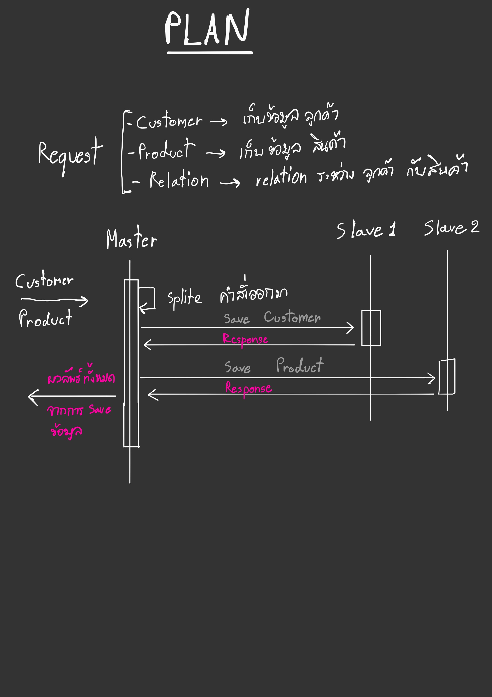

# master-slave

## Planing



## Task Programming

### How to create Task

1. Create by new object Task

```c#
var task = new Task(() => {});
var task2 = new Task<string>(() => return "" );
var result2 = task2.Result;
```

2. Create by Task Factory

```c#
var task = Task.Factory.StartNew(() => {});
var task2 = Task.Factory.StartNew<string>(() => return "" );
var result2 = task2.Result;
```

### How to cancelling task

Cancelling task We will use `CancellationTokenSource` for cancel task

This example will show you. When run application, if I press the read key it will be cancel token and loop while will be break.

***Example***

```c#
// Create cancel token
var cts = new CancellationTokenSource();

// Thread status this task is RanToCompletion
var task = Task.Factory.StartNew(() =>{
    while(true){
        // When token is cancelled. IsCancellationRequested will be true
        if(token.IsCancellationRequested){
            break;
        }
    }
}, cts.Token);

Consol.Readkey();
cts.Cancel();

```

### How to monitor Task

Monitor task is cancelled.

***Eaxample***

```c#
var cts = new CancellationTokenSource();
var task = Task.Factory.StartNew(() => {}, cts.Token);
var task2 = Task.Factory.StartNew<string>(() => return "", cts.Token);

// Create new task for monitor worker task is canceled.
Task.Factory.StartNew(() => {
    // Wait signal from this task.
    cts.Token.WaitHandle.WaitOne();

    // Handle task is canceled.
});

```

### Handle exception Task


## References

Sortware Architechtural [link](https://towardsdatascience.com/10-common-software-architectural-patterns-in-a-nutshell-a0b47a1e9013)

Architectural Patterns [link](https://www.ou.nl/documents/40554/791670/IM0203_03.pdf/30dae517-691e-b3c7-22ed-a55ad27726d6)